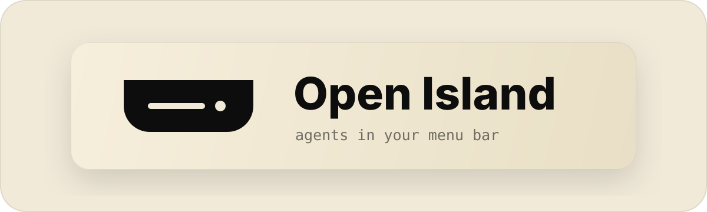

<p align="center">
  
</p>

<h1 align="center">Open Island — Reimagine</h1>

<p align="center">
  <strong>A GPL-3.0 fork of Open Island with notch usage chips for Codex · Grok · OpenCode (Copilot credits).</strong>
  <br>
  Open-source, local-first, native macOS companion for AI coding agents.
  <br><br>
  <a href="README.zh-CN.md">中文</a> | <strong>English</strong>
</p>

<p align="center">
  <a href="LICENSE"></a>
  <a href="https://github.com/leeyf2018/Openisland-Reimagine"></a>
</p>

---

## About this repository

| | |
|--|--|
| **This fork** | [leeyf2018/Openisland-Reimagine](https://github.com/leeyf2018/Openisland-Reimagine) |
| **Upstream** | [Octane0411/open-vibe-island](https://github.com/Octane0411/open-vibe-island) (Open Island) |
| **License** | [GPL-3.0](LICENSE) (same as upstream — **you must keep source available** if you redistribute) |
| **Attribution** | See [NOTICE](NOTICE) |

This is **not** a ground-up rewrite. It is a **derivative** of Open Island with layout and usage-monitoring enhancements used in a personal workflow, published so others can build and improve them under GPL-3.0.

### Fork highlights

- Notch header chips: **C** (Codex %), **G** (Grok %), **O** (GitHub Copilot **credits used**)
- Compact vertical chips + reset-day hints `(N)`
- Grok usage: local billing log + ~15s poll
- OpenCode / Copilot: `gh api /copilot_internal/user` (Business seats use `credits_used`)

Details: [docs/REIMAGINE_CHANGES.md](docs/REIMAGINE_CHANGES.md) · Build: [docs/BUILDING.md](docs/BUILDING.md)

### Download

| What you want | How |
|---------------|-----|
| **Prebuilt app (recommended for most people)** | Open [**Releases**](https://github.com/leeyf2018/Openisland-Reimagine/releases/latest) → download `OpenIsland-Reimagine-*.app.zip` → unzip → drag `Open Island.app` to `/Applications` |
| **Source ZIP only** | **Code → Download ZIP**, or [main.zip](https://github.com/leeyf2018/Openisland-Reimagine/archive/refs/heads/main.zip) → then build yourself ([docs/BUILDING.md](docs/BUILDING.md)) |

**First launch (prebuilt):** the Release app is **ad-hoc signed** (not Apple Developer ID / notarized). macOS may block it once:

1. Right-click `Open Island.app` → **Open** → confirm, **or**
2. **System Settings → Privacy & Security** → allow the blocked app

You do **not** need to build from source if you only want to run the prebuilt binary. Source remains available under GPL-3.0 for audit and modification.

---

## What is Open Island?

Open Island sits in your Mac's **notch** (or top bar) and gives you a real-time control surface for AI coding agents — session status, permission approvals, and jump-back to the right terminal.

Upstream project: [Octane0411/open-vibe-island](https://github.com/Octane0411/open-vibe-island).

## Quick start (build from source)

```bash
git clone https://github.com/leeyf2018/Openisland-Reimagine.git
cd Openisland-Reimagine

# Debug
swift build
swift run OpenIslandApp

# Or package a release .app
export OPEN_ISLAND_VERSION="1.1.6-reimagine"
export OPEN_ISLAND_PACKAGE_ROOT="$PWD/output/package"
./scripts/package-app.sh
```

Full steps, install paths, and `gh` notes: **[docs/BUILDING.md](docs/BUILDING.md)**.

### O chip (Copilot credits)

1. Install [GitHub CLI](https://cli.github.com/)
2. `gh auth login`
3. Confirm: `gh api /copilot_internal/user` returns JSON (not 401/404)

## Supported agents (upstream baseline)

Claude Code, Codex, Cursor, Gemini CLI, Kimi CLI, OpenCode, Qoder, Qwen Code, Factory, CodeBuddy, and more — see upstream README for the full compatibility table.

This fork does not remove upstream agents; it **adds** notch usage presentation for Codex / Grok / OpenCode(Copilot).

## Privacy

Local-first: no Openisland-Reimagine telemetry server. Usage chips read **local** logs / `gh` on your machine. See [PRIVACY_POLICY.md](PRIVACY_POLICY.md) and upstream policy intent.

## Contributing

PRs welcome. Please keep GPL-3.0, do not commit secrets, and prefer small focused diffs. Upstream contribution guide: [CONTRIBUTING.md](CONTRIBUTING.md).

If your change belongs in core Open Island for everyone, consider also proposing it **upstream**.

## License

```text
GNU General Public License v3.0
Copyright (C) Open Island contributors and this fork's contributors
```

- License text: [LICENSE](LICENSE)
- Upstream + fork notice: [NOTICE](NOTICE)

---

*Based on Open Island by the open-vibe-island community. Thank you to the upstream maintainers.*
